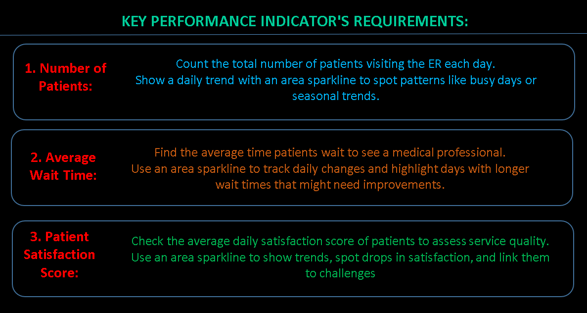
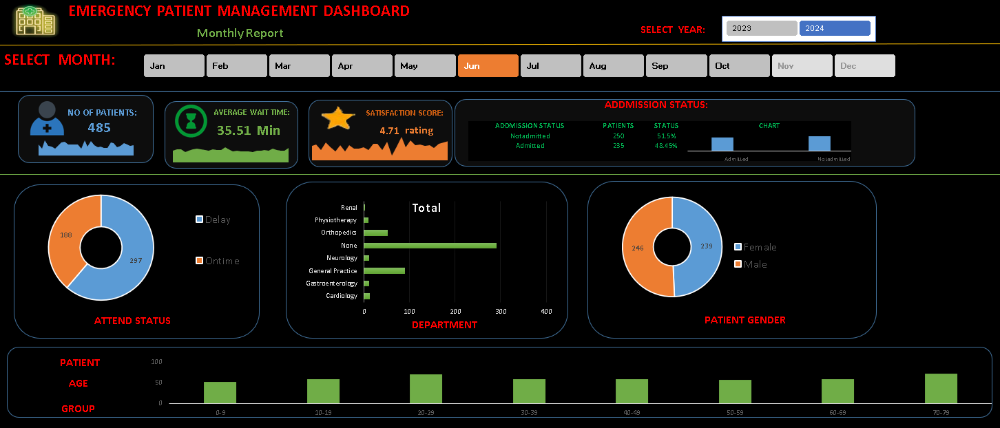

# Emergency Patient Management Dashboard
## 📊 Project Overview
The Emergency Patient Management Dashboard is a data analytics project designed to analyze Emergency Room (ER) patient data and provide meaningful insights into patient volume, waiting times, satisfaction, admissions, attendance, demographics, and department activity.
The dashboard provides an interactive view of key performance indicators (KPIs) to help understand patient trends and identify areas that may require operational improvement.
---
## 🎯 Project Objectives
The main objectives of this project are:
- Analyze the number of patients visiting the Emergency Room.
- Monitor the average patient waiting time.
- Evaluate patient satisfaction scores.
- Analyze patient admission status.
- Compare patients who attended on time and those who were delayed.
- Analyze patient distribution by gender.
- Understand patient distribution across different age groups.
- Identify departments receiving the highest number of patients.
- Track daily and monthly trends using visualizations.
---
## 📌 Key Performance Indicators
The dashboard focuses on three primary KPIs:
### 1. Number of Patients
Measures the total number of patients visiting the Emergency Room and helps identify busy periods and patient volume trends.
### 2. Average Wait Time
Measures the average amount of time patients wait before being attended by a medical professional.
### 3. Patient Satisfaction Score
Measures the average satisfaction score reported by patients and helps evaluate the overall quality of the patient experience.
---
## 📈 Dashboard Features
The dashboard includes:
- Year selection
- Month selection
- Total number of patients
- Average waiting time
- Patient satisfaction score
- Admission status analysis
- Attendance status analysis
- Patient gender distribution
- Department-wise patient analysis
- Patient age-group analysis
- Daily trend sparklines
- Interactive charts and visualizations
---
## 🔍 Analysis Areas
### Admission Status
The dashboard compares patients who were admitted with those who were not admitted.
### Attendance Status
Patients are categorized based on whether they were attended to on time or experienced a delay.
### Patient Gender
The dashboard provides a comparison of male and female patients.
### Department Analysis
Patient volumes are analyzed across different departments to identify areas with higher patient activity.
### Age Group Analysis
Patients are grouped into different age ranges to understand the demographic distribution of Emergency Room visits.
---
## 🛠️ Tools & Technologies
- Microsoft Excel 
- Data Cleaning
- Data Analysis
- Pivot Tables
- Charts & Visualizations
- KPI Analysis
- Dashboard Design
- Interactive Filters / Slicers
---
# 📊 Emergency Patient Management Dashboard

## 🔗 KPI Requirements

---

## 📈 Dashboard Preview

---

## 📂 Project Files

| File | Description |
|---|---|
| 📊 `Dashboard.png` | Emergency Patient Management Dashboard |
| 📋 `KPI.png` | KPI Requirements |
| 📁 `Hospital Emergency Room Data.csv` | Hospital emergency room dataset |
| 📊 `PATIENT MANAGEMENT.xlsx` | Excel dashboard/workbook |
└── Data/
